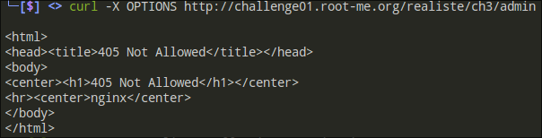
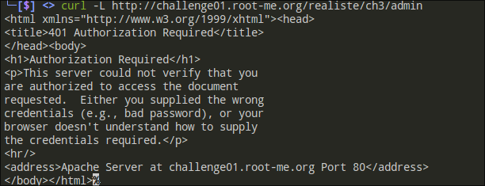
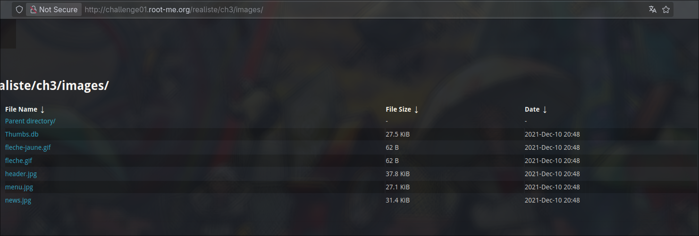
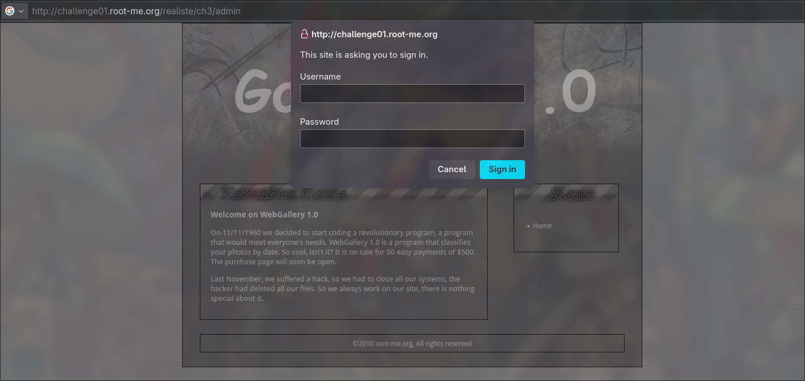
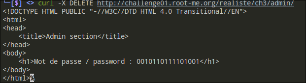
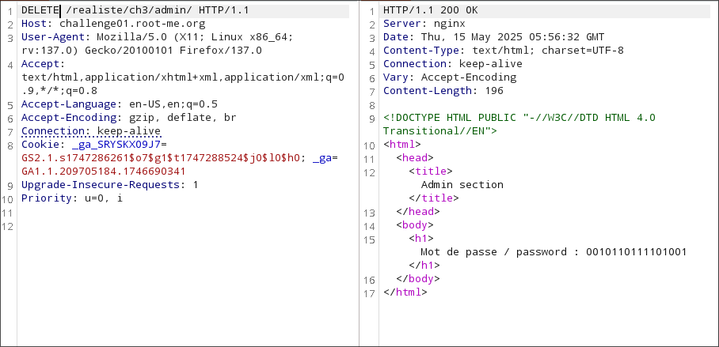

# 📋 Penetration Test Report: Eh oui, parfois

1. [Executive Summary](#executive-summary)
2. [Methodology](#methodology)
3. [Findings](#findings)
4. [Risk-Assessment](#risk-assessment)
5. [Recommendations](#recommendations)
6. [Conclusion](#conclusion)
7. [Appendices](#appendices)


## Executive Summary

### Objective

The challenge titled "Eh oui, parfois" is part of the "Réaliste" (Realistic) category on the Root Me platform.
The type of vulnerability exploited is HTTP method tampering.

### Difficulty Level:

- Classification: Very Easy
- Points: 10
- Target Audience: Beginners in cybersecurity and penetration testing.

### Author:

- Created by: na5sim

### Publication Date:

- Date: June 8, 2010


## Methodology

1. **Reconnaissance**
   - Initial directory and file enumeration using `curl` and browser.
   - Checked for redirects, HTTP methods, and authentication challenges.

2. **Authentication Mechanism Review**
   - Identified the presence of HTTP Basic Authentication via `401 Unauthorized` and `WWW-Authenticate` headers.
   - Explored default credentials and tested common username/password pairs.

3. **File and Directory Enumeration**
   - Attempted to access `.htaccess`, `.htpasswd`, `.git` directories and any **Apache-related** files.
   - Used `curl` and browser to probe possible misconfigurations and sensitive files.

4. **Exploit Attempts**
   - Tested HTTP method overrides (e.g., `OPTIONS`, `HEAD`) for bypass opportunities.
   - Checked for misconfigured access to version control metadata (e.g., `.git/HEAD`).
   - Searched for exposed credentials or hash leaks.

## Findings

- Attempts to retrieve `.htaccess`, `.htpasswd`, or Git metadata were blocked with 403 errors.


- The server (nginx/Apache hybrid environment) returned a proper 401 challenge, indicating correctly configured access restrictions.


- Attempting to access common directories such as `robots.txt` & `images` based on the home page context.



```
Result: No valuable or sensitive information identified
```

- The `/admin/` directory is protected by HTTP Basic Authentication.

- Bypass auth with HTTP methods


> The HTTP DELETE method was improperly configured and allowed access to protected resources without valid credentials, effectively bypassing authentication.

=> This type of vulnerability should not be enabled especially on sensitive endpoints.




```
FLAG = 0010110111101001
```

## Risk Assessment

- Severity: Medium
- CVSS Score: 6.5 (Medium)
- Vector: CVSS:3.1/AV:N/AC:L/PR:N/UI:N/S:U/C:L/I:L/A:N
- Impact: Unauthorized access to sensitive areas of the application.
- Likelihood: Medium, given the simplicity of the bypass method.

## Recommendations


- Enhance Authentication Mechanisms: Implement more robust authentication methods, such as multi-factor authentication (MFA).
- Access Controls: Strengthen access controls and ensure proper configuration of server settings to prevent HTTP method tampering.
- Disable Unused HTTP Methods: Restrict HTTP methods to only those required (typically GET and POST).
- Web Server Hardening: Ensure server configuration does not expose sensitive directories or metadata.

## Conclusion

The challenge "Eh oui, parfois" demonstrated a basic yet effective example of how HTTP method tampering can be exploited to bypass authentication mechanisms. It underscores the importance of robust security practices and regular audits to safeguard against such vulnerabilities.

## Appendices


- Tools Used: curl, BURP suite & Browser Developer Tools
- References: Root Me platform, HTTP Basic Authentication documentation
